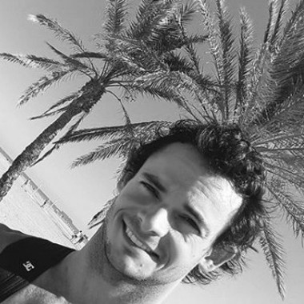

```{r echo=FALSE}
library("emo")
```

```{r echo=FALSE}
ctries <- c(
  ji("Argentina"),
  ji("brazil"),
  ji("Paraguay"),
  ji("Chile"),
  ji("Uruguay"),
  ji("Ecuador"),
  ji("bolivia"),
  ji("Peru"),
  ji("Colombia"),
  ji("Panama"),
  ji("Costa_Rica"),
  ji("Nicaragua"),
  ji("Honduras"),
  ji("Guatemala"),
  ji("belize"),
  ji("Mexico"),
  ji("Germany"),
  ji("Spain"),
  ji("Andorra"),
  ji("Morocco"),
  ji("Ireland"),
  ji("Georgia"),
  ji("Denmark"),
  ji("Sweden"),
  ji("Netherlands"),
  ji("belgium"),
  ji("France"),
  ji("Italy"),
  ji("Vatican_City"),
  ji("Slovenia"),
  ji("Croatia"),
  ji("Austria"),
  ji("Czechia"),
  ji("Slovakia"),
  ji("us"),
  ji("Cuba"),
  ji("thailand"),
  ji("Laos"),
  ji("Vietnam"),
  ji("Cambodia"),
  ji("Indonesia"),
  ji("Singapore"),
  ji("Malaysia"),
  ji("United_Arab_Emirates")
)
```

```{r, out.width='15%', fig.align='center', echo=FALSE, border.radius='50%'}
# knitr::include_graphics(sample(dir("images", full.names = TRUE),1))
# 
```

<center>
</br>


<script>
document.getElementById('id').style.borderRadius = '50%';
</script>

#### Juan Cruz Rodriguez

I have a PhD in Computer Science, and I am finishing my master's degree in Applied Statistics (hopefully I will defend the thesis this year `r ji("sweat_smile")`). However, I would like to define myself as a computer science enthusiast. I really enjoy coding. My soul mate programming language is R `r ji("ring")`, however, I sometimes cheat on it with Python, C and C ++ `r ji("stuck_out_tongue_closed_eyes")`.
I am always looking to gain new knowledge, no matter what area, but with an emphasis on computer science and statistics.

Science advances thanks to publicly available knowledge, so, for me, open-source coding is ideal. One of the most rewarding experiences is to see how useful for others are a contribution or tool made by me. I am really interested in making Data Science available to everyone.

Thanks to my doctoral studies, I was able to live for a few months in Spain and the United States. This, besides that I love to travel, and I am very good at it, I had the opportunity to visit more than 35 countries:

[ `r ctries` ]

(if your country is not on the list, do not hesitate to invite me `r ji("joy")`).

I love playing futbol `r ji("soccer")`, and I am a fervent fan of [Instituto A.C.C.](http://www.InstitutoACC.com.ar/) (`r lapply(c("soccer", "basketball", "field_hockey", "volleyball"), ji)`, etc.). As a good Argentino, you will see me most of the time carrying and drinking my mate`r tryCatch(ji("mate"), error=function(e) "")`.


</center>
